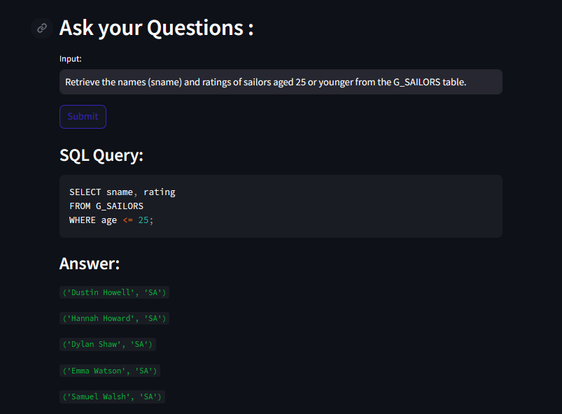
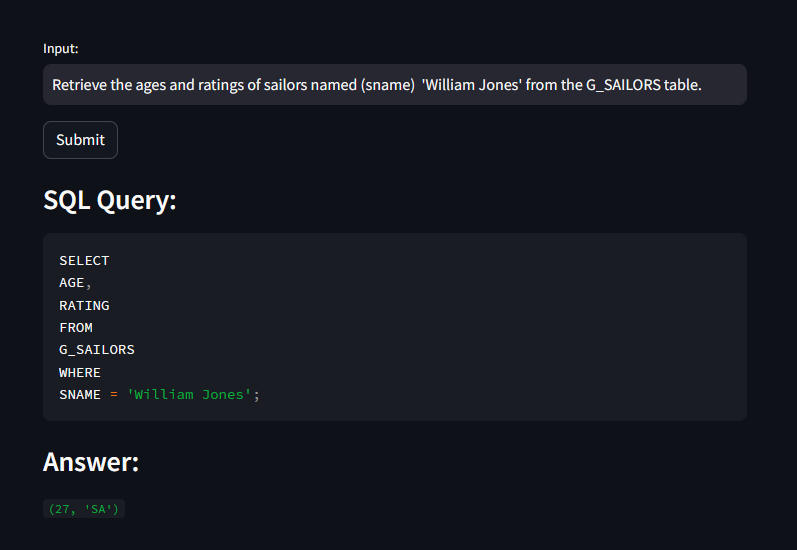
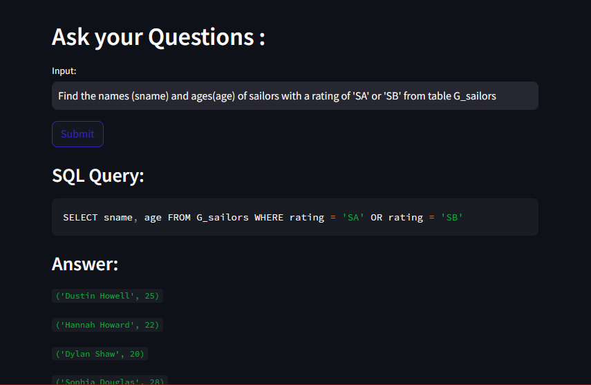

# SQL Commander: Create, Query, and Explore - A LLM Project

This Python application provides an English to SQL chatbot interface. Users can input English questions, and the chatbot generates corresponding SQL queries using the Gemini model. The generated SQL queries are executed on an SQLite database, and the results are displayed.

## Getting Started

Follow these steps to set up and run the SQL-Commander LLM application:

### Prerequisites

- Python 3.9 installed on your machine.
- [Google Generative AI API Key](https://ai.google.dev/tutorials/setup)

### Installation

1. Clone the repository:

   ```bash
   git clone https://github.com/AJAmit17/SQL-Commander.git
   cd SQL-Commander
   ```

2. Create and activate a virtual environment:
    ```bash
    python3 -m venv venv
    
    #for Linux,MacOS systems
    source venv/bin/activate

    #for Windows systems
    venv\Scripts\activate 
    ```

3. Install the required dependencies:

   ```bash
   pip install -r requirements.txt
   ```

4. Create a `.env` file in the project root and add your Google Generative AI API Key:

   ```bash
   GOOGLE_GEMINI_API_KEY= "your-api-key"
   ```

### Execution

1. Run the SQLite Query Executor:

   ```bash
   streamlit run main.py
   ```

   This will launch the Streamlit web interface.

2. Enter SQL queries in the provided text area and click "Execute Queries" to test SQL execution.

3. For English to SQL conversion, input questions in the "Input:" text area and click "Ask the Question".


## Example: Creating and Populating a Database Table

Consider a scenario where you want to create and populate a database table named `G_SAILORS` with the following structure:

```sql
CREATE TABLE G_SAILORS (
    sid INT PRIMARY KEY,
    sname VARCHAR(20) NOT NULL,
    rating VARCHAR(10) NOT NULL,
    age INT NOT NULL
);

INSERT INTO G_SAILORS (sid, sname, rating, age) VALUES (22, 'Dustin Howell', 'SA', 25);
INSERT INTO G_SAILORS (sid, sname, rating, age) VALUES (85, 'Hannah Howard', 'SA', 22);
INSERT INTO G_SAILORS (sid, sname, rating, age) VALUES (31, 'Dylan Shaw', 'SA', 20);
INSERT INTO G_SAILORS (sid, sname, rating, age) VALUES (65, 'Audrey Moore', 'SA', 24);
INSERT INTO G_SAILORS (sid, sname, rating, age) VALUES (42, 'William Jones', 'SA', 27);
```

Q1. Retrieve the names (sname) and ratings of sailors aged 25 or younger from the G_SAILORS table.



Q2. Retrieve the ages and ratings of sailors named 'William Jones' from the G_SAILORS table.



Q3. Find the names (sname) and ages(age) of sailors with a rating of 'SA' or 'SB' from table G_SAILORS.



### NOTE
- Create the table first and Ask Question to get proper output
- You need to mention attribute name and table names properly while giving the question
- It is better to add Schema of the table with appropriate attributes name in questions to get more accurate answers